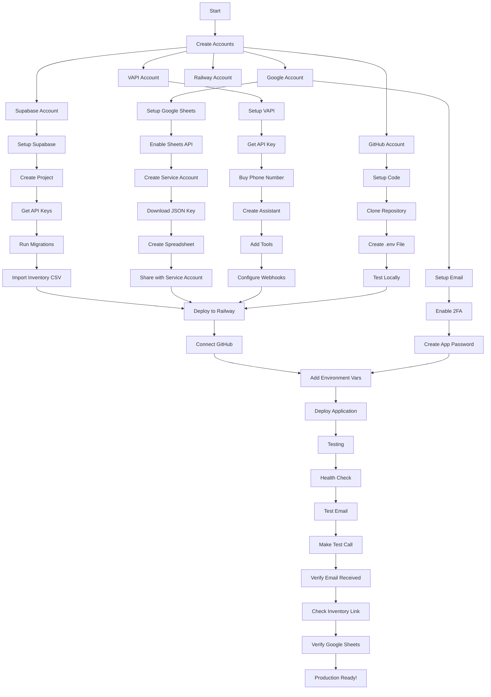

# 📐 Implementation Flow Diagram

## Complete Setup Flow - From Zero to Production



## 🔄 Data Flow During a Call

```
┌─────────────────────────────────────────────────────────────────┐
│                        Customer Calls                            │
│                     +1 (475) 422-8650                           │
└───────────────────────────┬─────────────────────────────────────┘
                            │
                            ▼
┌─────────────────────────────────────────────────────────────────┐
│                    VAPI Answers Call                             │
│         "Thank you for calling! May I have your name?"          │
└───────────────────────────┬─────────────────────────────────────┘
                            │
                            ▼
┌─────────────────────────────────────────────────────────────────┐
│                  AI Collects Information                         │
│    • Name ✓    • Phone ✓    • Email ✓ (Required)               │
│    • Vehicle: Year, Make, Model, Mileage, Budget               │
└───────────────────────────┬─────────────────────────────────────┘
                            │
                            ▼
┌─────────────────────────────────────────────────────────────────┐
│              enhancedLeadQualification Tool                      │
│                   Webhook to Railway                             │
└───────────────────────────┬─────────────────────────────────────┘
                            │
                ┌───────────┴───────────┬─────────────┐
                ▼                       ▼             ▼
┌─────────────────────┐ ┌─────────────────────┐ ┌─────────────────┐
│  Store in Supabase  │ │  Search Inventory   │ │ Log to Sheets   │
│  • customers table  │ │  • Match criteria   │ │ • Real-time     │
│  • vehicle_interests│ │  • Generate link    │ │ • Lead score    │
└─────────────────────┘ └──────────┬──────────┘ └─────────────────┘
                                   │
                                   ▼
┌─────────────────────────────────────────────────────────────────┐
│                    Schedule Communications                       │
│     • SMS (if enabled) - Immediate                             │
│     • Email - 20 minute delay                                  │
│     • Education series - Days 1-14                             │
└─────────────────────────────────────────────────────────────────┘
                                   │
                                   ▼
┌─────────────────────────────────────────────────────────────────┐
│                     Customer Experience                          │
│  1. Gets personalized link: /inventory/abc123def               │
│  2. Views matched vehicles with photos                         │
│  3. Sees salesperson contact info                              │
│  4. Can submit contact form                                    │
└─────────────────────────────────────────────────────────────────┘
```

## 🎛️ Configuration Map

```
.env File                    →  Railway Variables
─────────────────────────────────────────────────
SUPABASE_URL                 →  Project Settings → API → URL
SUPABASE_ANON_KEY           →  Project Settings → API → anon key
GOOGLE_SHEETS_CREDENTIALS    →  Service Account JSON (single line)
SPREADSHEET_ID              →  From Google Sheets URL
VAPI_API_KEY                →  VAPI Dashboard → API Keys
VAPI_PHONE_NUMBER           →  VAPI Dashboard → Phone Numbers
EMAIL_USER                  →  your.email@gmail.com
EMAIL_APP_PASSWORD          →  16-char password (no spaces)
BASE_URL                    →  https://your-app.railway.app
```

## 🔍 Where Everything Lives

```
GitHub Repository
├── src/
│   ├── server.js           → Main application entry
│   ├── routes/
│   │   ├── vapi-tools-enhanced.js  → AI webhook handlers
│   │   └── inventoryDisplay.js     → Customer web pages
│   └── services/
│       ├── supabaseEnhanced.js     → Database operations
│       ├── emailService.js         → Email sending
│       └── communicationScheduler.js → Background jobs
├── migrations/
│   └── full_enhanced_setup.sql     → Database schema
├── scripts/
│   ├── importInventory.js          → CSV importer
│   └── setupEducationCampaigns.js  → Email templates
└── .env                            → Local configuration

Supabase Database
├── customers               → Lead information
├── inventory              → Vehicle listings
├── vehicle_interests      → What customers want
├── call_transcripts       → Full conversation logs
├── communication_logs     → Email/SMS queue
├── shared_links          → Trackable inventory URLs
├── sales_assignments     → Salesperson mapping
└── education_campaigns   → Automated email series

VAPI Platform
├── Assistant             → Lead Qualifier AI
├── Tools                → enhancedLeadQualification
│                       → enhancedInventorySearch
└── Phone Number        → +1 (475) 422-8650

Railway Hosting
├── Environment Vars    → All .env values
├── Deployment         → Auto from GitHub
├── Logs              → Real-time monitoring
└── Domain            → your-app.railway.app
```

## ⏱️ Implementation Timeline

### Day 1 (4-6 hours)
- [ ] Create all accounts (30 min)
- [ ] Setup Supabase database (1 hour)
- [ ] Configure Google Sheets (1 hour)
- [ ] Create VAPI assistant (1 hour)
- [ ] Setup GitHub repository (30 min)
- [ ] Configure .env file (30 min)

### Day 2 (3-4 hours)
- [ ] Deploy to Railway (1 hour)
- [ ] Configure email service (30 min)
- [ ] Import inventory data (30 min)
- [ ] Test all connections (1 hour)
- [ ] Make test calls (1 hour)

### Day 3 (2-3 hours)
- [ ] Train team members (1 hour)
- [ ] Document phone scripts (30 min)
- [ ] Set up monitoring (30 min)
- [ ] Go live! (1 hour)

## 🎯 Success Metrics

```
┌─────────────────────────────────────────────────────────────┐
│                    KPIs to Monitor                          │
├─────────────────────────────────────────────────────────────┤
│ Metric                │ Target    │ Where to Check         │
├───────────────────────┼───────────┼────────────────────────┤
│ Call Answer Rate      │ 100%      │ VAPI Dashboard         │
│ Email Capture Rate    │ >90%      │ Google Sheets          │
│ Email Delivery Rate   │ >95%      │ communication_logs     │
│ Link Click Rate       │ >60%      │ shared_links table     │
│ Lead Score >70        │ >30%      │ Google Sheets          │
│ Response Time         │ <2 min    │ call_transcripts       │
└───────────────────────┴───────────┴────────────────────────┘
```

This implementation flow ensures nothing is missed during setup!