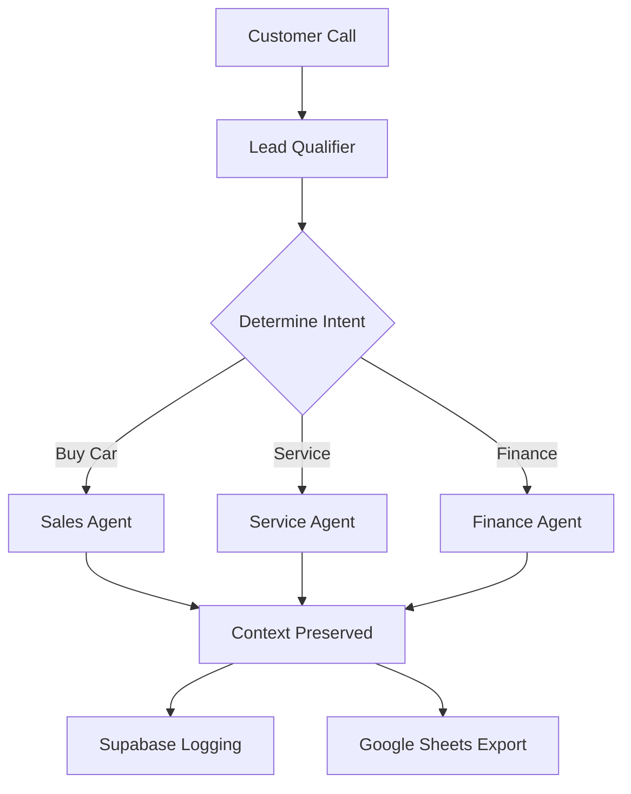

# Agent Transfer System Implementation

## Overview
The Agent Transfer System enables seamless handoffs between specialized agents based on customer intent and conversation context.

## Technical Architecture

### 1. Transfer Tool Configuration

```javascript
// transferToAgent tool
{
  "name": "transferToAgent",
  "description": "Transfer the call to a specialized agent based on customer needs",
  "parameters": {
    "type": "object",
    "properties": {
      "targetAgent": {
        "type": "string",
        "enum": ["sales", "service", "finance", "parts", "human"],
        "description": "The agent to transfer to"
      },
      "context": {
        "type": "object",
        "description": "Conversation context to pass to next agent",
        "properties": {
          "customerInfo": {
            "type": "object",
            "description": "Customer details from lead qualification"
          },
          "intent": {
            "type": "string",
            "description": "Customer's primary intent"
          },
          "summary": {
            "type": "string",
            "description": "Brief summary of conversation so far"
          }
        }
      },
      "callId": {
        "type": "string",
        "description": "Current call ID"
      }
    },
    "required": ["targetAgent", "context", "callId"]
  }
}
```

### 2. Backend Implementation

```javascript
// Handler for agent transfer
async function handleAgentTransfer(args, res) {
    const { targetAgent, context, callId } = args;
    
    // Log transfer in database
    await supabase.logTransfer({
        call_id: callId,
        from_agent: 'leadQualifier',
        to_agent: targetAgent,
        context: context,
        timestamp: new Date().toISOString()
    });
    
    // Return VAPI transfer directive
    return res.json({
        results: [{
            toolCallId: args.toolCallId || 'default',
            result: `Transferring you to our ${targetAgent} specialist who can better assist you.`
        }],
        // VAPI transfer directive
        transfer: {
            assistantId: getAssistantId(targetAgent),
            context: context
        }
    });
}
```

### 3. VAPI Assistant Configuration

Each specialized assistant needs:
- Unique assistant ID in VAPI
- Access to shared context
- Specific tools for their domain

### 4. Context Preservation

```javascript
// Shared context structure
{
  "sessionId": "unique-session-id",
  "customerInfo": {
    "name": "John Doe",
    "phoneNumber": "+1234567890",
    "email": "john@example.com",
    "budget": 30000,
    "urgency": "high"
  },
  "conversationHistory": [
    {
      "agent": "leadQualifier",
      "summary": "Customer looking for SUV under $30k"
    }
  ],
  "currentIntent": "vehicle-purchase"
}
```

## Implementation Steps

1. **Create Transfer Tool in VAPI**
   - Add transferToAgent tool with proper parameters
   - Configure in Lead Qualifier assistant

2. **Update Backend Routes**
   - Add transfer handler to vapi-tools.js
   - Implement context storage/retrieval

3. **Create Specialized Assistants**
   - Sales Assistant (with inventory lookup)
   - Service Assistant (with scheduling)
   - Finance Assistant (with calculator tools)

4. **Test Transfer Flow**
   - Lead Qualifier → Sales Agent
   - Sales Agent → Finance Agent
   - Any Agent → Human

## Data Flow



## Benefits

1. **Specialized Handling**: Each agent is expert in their domain
2. **Context Preservation**: No repeated questions
3. **Scalability**: Easy to add new agents
4. **Analytics**: Track transfer patterns and optimize flow